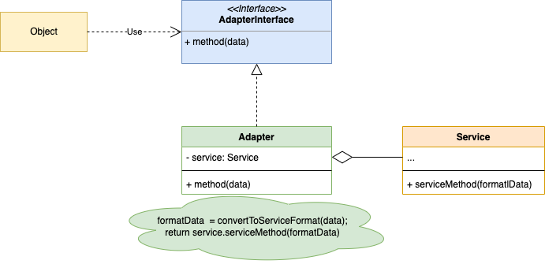

# Adapter Design Pattern

The Adapter pattern allows objects with incompatible interfaces to work together. It acts as a bridge between two incompatible interfaces by converting the interface of a class into another interface that a client expects.

## Use Cases

- **Legacy System Integration**: Adapt old systems to work with new code without modifying the legacy code.
- **Third-party Library Integration**: Make external libraries work with your existing codebase.

### Example code [VGA HDMI Analogy](HdmiVgaAnalogy)
- VGA: The target interface that the client (UniteCentral) expects to use.
- Tv: The adaptee, which has an incompatible interface (HDMI).
- HdmiVgaAdapter: The adapter that implements the VGA interface and contains an instance that implements the Hdmi interface.
- UniteCentral: The class that uses the VGA interface, remaining unaware of the adaptation happening.

### UML Diagram

### Note
- The Adapter pattern can be implemented in two ways: **Class Adapter** and **Object Adapter**.
- The **Class Adapter** implements the standard interface and inherits the adaptee class, but this is a tightly coupled approach.
- The **Object Adapter** uses composition to adapt the adaptee class, which is a loosely coupled approach.

