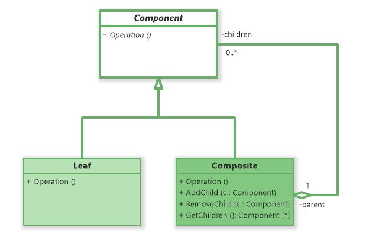

### Composite Design Pattern

The Composite design pattern is a structural pattern that allows individual objects and compositions (groups of objects) to be treated uniformly, forming part-whole hierarchies.

**Key Components**:
1. **Component**: Common abstract class (e.g., `FileSystemItem`).
2. **Leaf**: Individual objects (e.g., `File`).
3. **Composite**: Objects that can contain other objects (e.g., `Folder`).

**Folder Structure Analogy**:
- **Folders** can contain **Files** (individual objects).
- Folders can also contain other **Folders** (composite objects).
- Both can be treated as "File System Items," forming a tree structure.
---

### Example in Java:
- Look at the example in this folder: [Composite Design Pattern Example](composite)

### Key Points:
1. **Uniform Treatment**: Both `File` and `Folder` implement `getSize()`, allowing them to be treated the same way.
2. **Recursive Structure**: Folders can contain files or other folders, forming a tree structure.
3. **Transparency**: Clients don’t need to know whether they are working with a single object or a composition of objects.

### UML Diagram:

