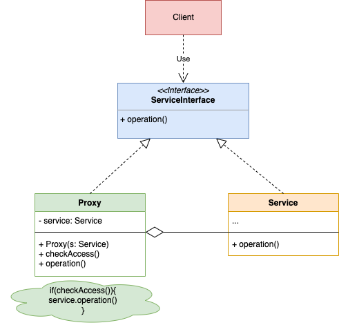

# Proxy Design Pattern Overview

## Definition:
- The **Proxy** is a **structural design pattern** that acts as an intermediary between the client and the target object, controlling access to the latter.

## UMl Diagram:

## Main Concept:
- A **proxy** intercepts method calls to the target object, enabling it to perform actions **before** and/or **after** forwarding the call to the target.

## Structure:
- The **Client** interacts with an **abstraction** (interface or abstract class).
- The **target object** is a concrete implementation of this abstraction.
- The **Proxy** implements the same abstraction and holds a reference to the **real object** (target).

## Proxy Responsibilities:
- **Before Action**: The proxy can conduct checks or perform operations before invoking the target method.
- **After Action**: Additional operations can be executed post-invocation of the target method.

## Common Use Cases:
1. **Access Control**: Validate if the client has the appropriate permissions to invoke specific operations.
2. **Caching**: Store results of expensive operations to optimize performance by returning cached responses for repeated calls.
3. **Logging**: Introduce logging functionality without modifying the underlying target object.
4. **Lazy Initialization**: Delay the creation of a resource-intensive object until it is required.

## Advanced Usage:
- **Proxy Chaining**: Proxies can be composed, allowing the combination of multiple proxy functionalities (e.g., **Caching + Logging + Security**).

## Design Consideration:
- **Interface Implementation**: Proxies must adhere to the same interface as the target object, enabling seamless substitution without altering client code.
